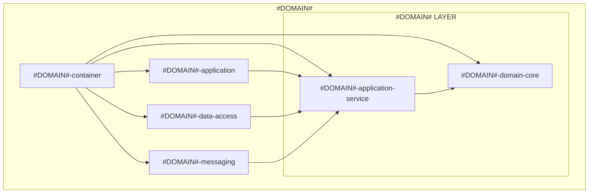

# 테스트 프로젝트 입니다

## 프로젝트 소개
- 음식 주문 서비스 토이 프로젝트

## 프로젝트 구조
```
food-order/
├── order-service         # 주문 처리 서비스
├── restaurant-service    # 레스토랑 및 메뉴 관리 서비스
├── payment-service       # 결제 처리 서비스
└── customer-service      # 고객 정보 관리 서비스
```

### 각 도메인별 기본 구조
